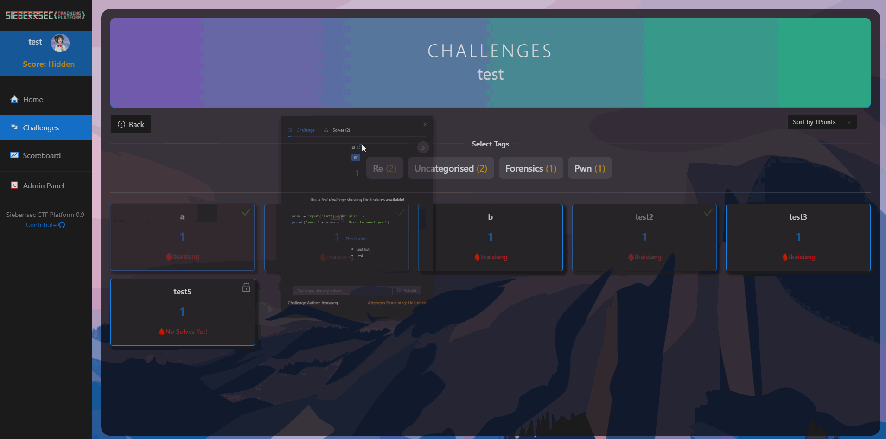
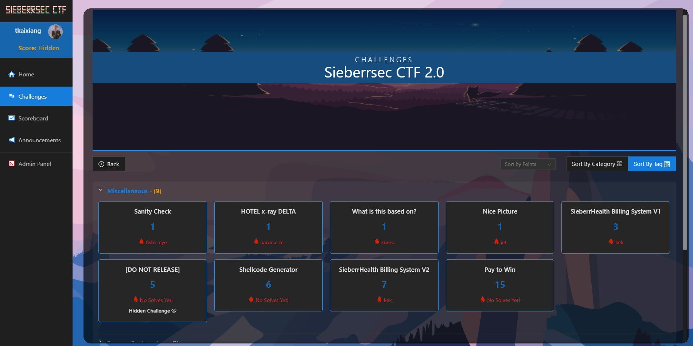
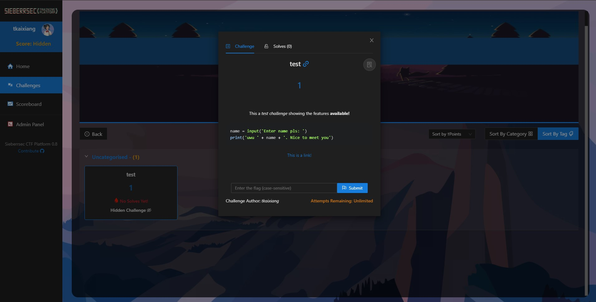
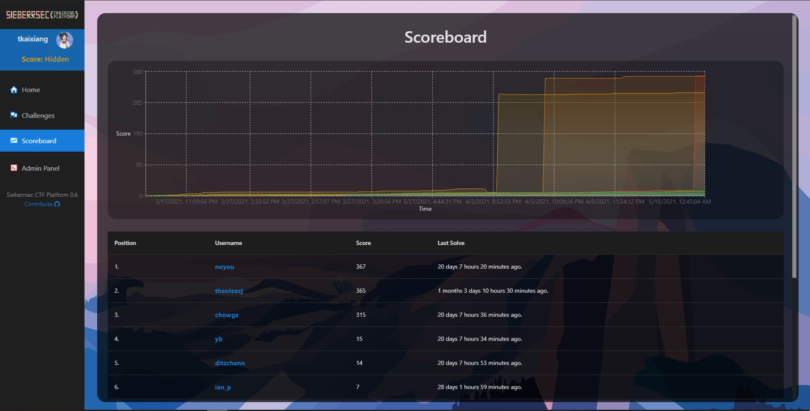
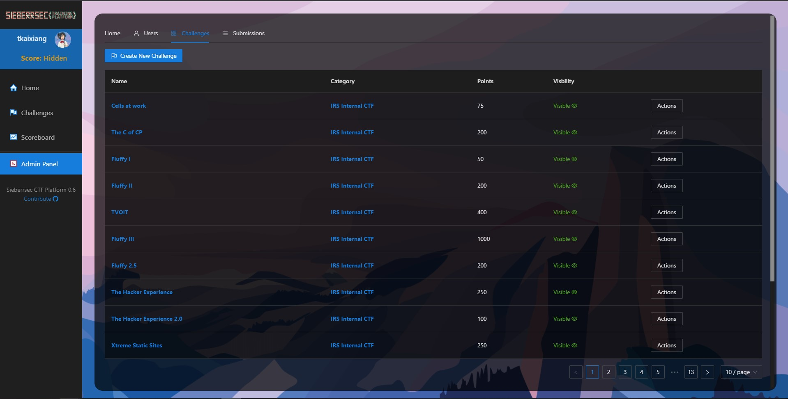
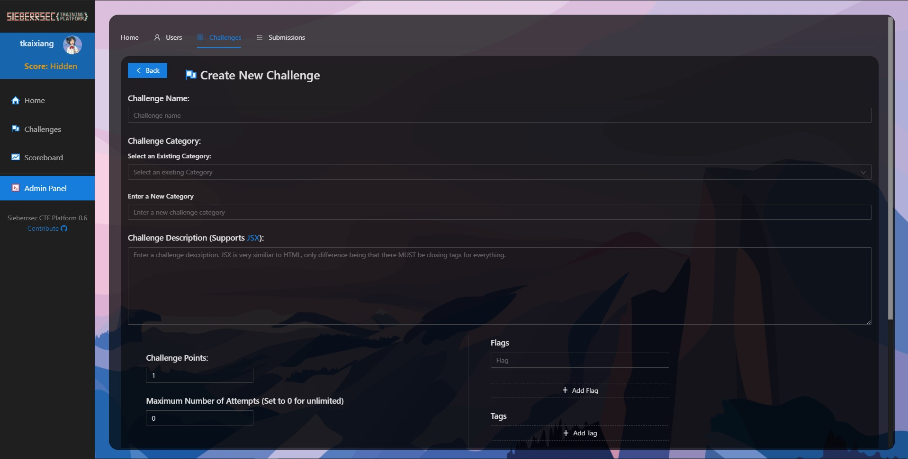
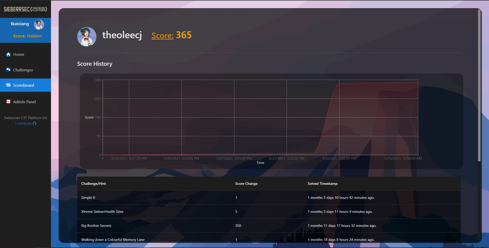
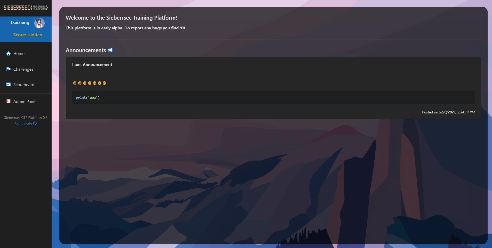
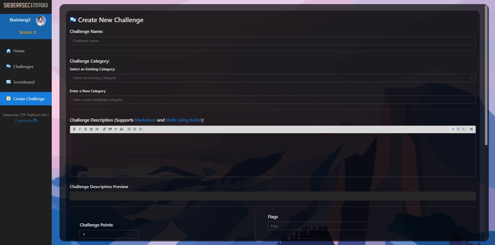

# Sieberrsec CTF Platform 😃



Sieberrsec CTF platform. A Jeopardy CTF platform designed with various neat features to aid in training and learning. Written in ReactJS and NodeJS

## Installation & Documentation 📘
The platform can be installed **in a few easy steps** using Docker. Simply check out [installation](https://github.com/IRS-Cybersec/ctf_platform/wiki/Docker-Production-Deployment).

Please check out the [wiki](https://github.com/IRS-Cybersec/ctf_platform/wiki) for usage/API documentation!

## Demo 💻
You can find a working copy of the platform [here](http://de.irscybersec.tk). Feel free to register a new account, or use one of the following pre-made accounts:
**Normal Account:**
```bash
Username: user
Password: 123
```
**Admin Account:**
```bash
Username: root
Password: toor
```
_Please exercise caution and do not use any person emails/passwords/usernames/any other info_

## Features 🎆
- "**Categories**" 🗄️ for better organization of challenges into different "events"
- **Sorting of challenges** 🏷️ by their tags (`Forensics`, `Pwn` etc.)
- **Announcements** 📢 with markdown support
- **Dynamic Scoring** 💯 for challenges
- **Markdown supported Challenge Descriptions** ✔️ that allow you to add **code blocks with syntax highlighting** and more
- **Live Scoreboard** 🥇 that is relatively light on the server
- **Writeup links** 🔗 per challenge (along with the option to only release writeups after submitting the flag)
- **Challenge Creator Role** 🧔 so as to allow challenge authors to submit challenges without having full admin access
- **Set Required Challenges** 🔐 to unlock other challenges
- **Easy Docker Deployment** 📮 in a few steps
- Links to each challenge so that individual challenges can be shared
- Easy management of the platform via an integrated Admin Panel
  - Disable registration, change permissions, edit passwords etc.

Feel free to take a look at the screenshots below for a peek at what the platform can do!

## Screenshots 🖼️



*Challenges page. Includes "Categories" to better sort challenges into various events and more*


*In each category, challenges are automatically sorted according to the tags assigned to each challenge by default. You can also all the challenges in a category by switching to "Sort by Category" mode and sort them using various sort options such as in Ascending Amount of Points*



*Modal for a challenge*



*Scoreboard of the platform*



*Admin panel showing the list of challenges. Here you can create, edit and delete challenges.*



*Create a new challenge page*



*Profile page of a user*



*Home page with announcements*



*Challenge creation page for challenge authors without access to the admin panel*
